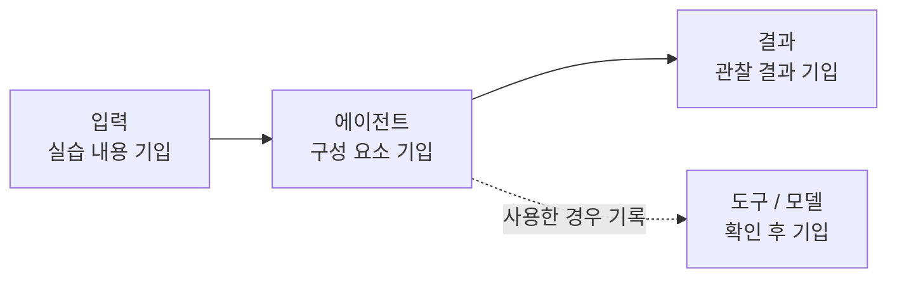

# KFA AI 에이전트 스터디 포트폴리오

박형민이 KFA 「AI 에이전트 만들기」 스터디에서 실습한 내용과 결과를 기록합니다. 외부 독자가 맥락을 알 수 있도록 주간 기록과 결과물을 함께 정리합니다.

## 에이전트 구조

## 단계별 결과

| 날짜 | 한 일 | 결과물 |
| --- | --- | --- |
| 기록 추가 후 작성 | 기록 추가 후 작성 | [주간 기록](logs/) |

## 핵심 성과

기록과 노트북 출력에서 확인된 수치만 기입합니다. (기록 추가 후 작성)

## 배운 점

주간 기록의 메모를 바탕으로 작성합니다. ([주간 기록 보기](logs/))